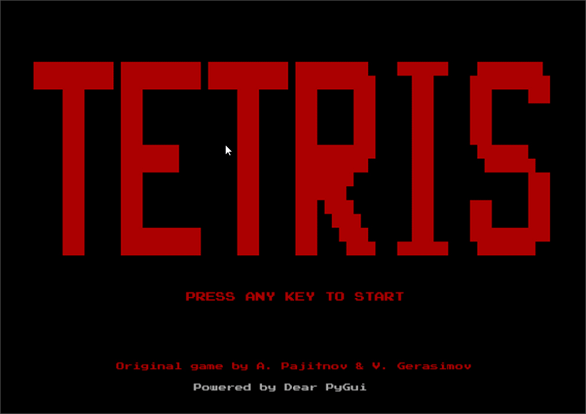

# :joystick: Tetris Game



The original Tetris tile-matching game as adopted by IBM PC.

Game developed purely on python using the [Dear PyGui Framework](https://github.com/hoffstadt/DearPyGui).

<h2>:book: Instructions</h2>

1. Make sure you have Python 3 installed and working. 
   
2. Clone the repo:

```git clone https://github.com/RahulShagri/OG-Tetris-Game.git```

3. Install prerequisites using pip, preferably in a new environment:

```pip install -r requirements.txt``` 

4. Run the <i>tetris_game.py</i> file to start the application.
